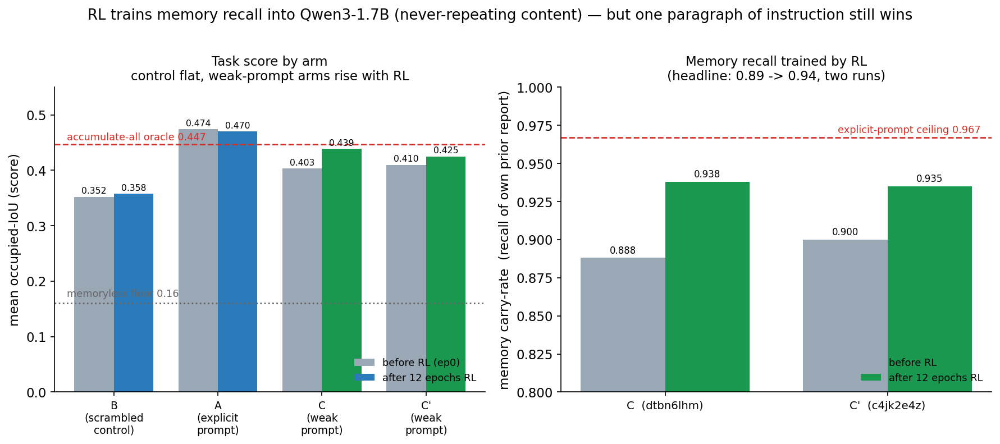

# Training *memory recall* into a small LLM with RL

A small, self-contained write-up of a reinforcement-learning result on **Qwen3-1.7B**: GRPO
reproducibly improves the model's **memory recall** on a continual-monitoring task whose content
**never repeats** — with controls that rule out weight-memorization and single-step skill gains as
the explanation. It also documents, honestly, where the same recipe *fails* (a second task the 1.7B
cannot learn even when handed the answer schema).

**One-line result:** the model's memory **carry-rate** — the fraction of its own remembered state it
preserves from one step to the next — rises from **~0.89 → ~0.94** across two independent GRPO runs on
never-repeating task content; a scrambled-memory control stays flat; and one paragraph of explicit
instruction still beats 12 epochs of RL. *If you can write the instruction, write the instruction* —
but where you can't, RL moves the behavior in the right direction.

## What's in here

| path | what |
|---|---|
| **[blogpost.md](blogpost.md)** | The full write-up, with both figures and the honesty caveats. |
| **[task/task_description.md](task/task_description.md)** | The two CLBench-derived tasks — real prompts, scoring, and the anti-cheating design. |
| **[data/](data/)** | The underlying numbers as CSV (per-epoch curves + summaries). See the [data dictionary](data/README.md). |
| **[assets/](assets/)** | The figures (regenerable from `data/`). |

## Headline numbers

| run | arm | prompt | memory echo | occ (score) start→end | carry-rate start→end |
|---|---|---|---|---|---|
| `fva3tx6z` | **A** | explicit | real | 0.474 → 0.470 *(saturated — no headroom)* | 0.967 → 0.972 |
| `geote9qj` | **B** | explicit | **scrambled** | 0.352 → 0.358 *(flat control)* | — |
| `dtbn6lhm` | **C** | weak | real | 0.403 → **0.439** | **0.888 → 0.938** |
| `c4jk2e4z` | **C′** | weak | real | 0.410 → **0.425** | **0.900 → 0.935** |

Reference points: memoryless floor ≈ 0.16 occ; naive accumulate-all oracle 0.447 occ; explicit-prompt
recall ceiling 0.967 carry. Runs: Qwen3-1.7B on Fireworks RFT (GRPO, LoRA), 12 epochs, lr 1e-4, temp 1.2.

## Honesty box

- The score-level effect is **small** (+0.01–0.02 occ), inside the ±0.02 band/detector-noise floor — it
  clears the floor by *slope consistency across two runs* and by the **behavioral** carry-rate measure,
  not by raw magnitude.
- 12 epochs of RL **did not** reach the instruction ceiling (carry 0.94 vs 0.967). Prompting is the
  stronger, cheaper lever at this model size.
- The effect is shown on **one** task. A second CLBench task (`database_exploration`) is a **flat null**
  on the 1.7B even when the schema is handed over — documented here rather than hidden. See the blog post's
  "The second task didn't train" section and `data/dbx_second_task.csv`.
- `memory_gain` replicated in only one of the two C-runs; the claim rests on carry-rate + the occ slope.

## Reproduce

The figures and every number come straight from the CSVs in `data/` (fetched from the Fireworks RFT job
metrics `curves.average.*`). Regenerate the charts with any plotting script over `data/spectrum_occ_by_epoch.csv`
and `data/dbx_second_task.csv`. The training harness itself (dataset builders, evaluators, reward functions)
is not vendored here — this repo is the **results + methodology** write-up.

## Attribution & license

Both tasks are **derived from** the Continual-Learning Bench (CLBench) task family (blind spectrum
monitoring; database exploration); this repo redistributes neither CLBench's data nor its canary strings —
only our own measured results and task re-descriptions. Repo content is released under the
[MIT License](LICENSE).
