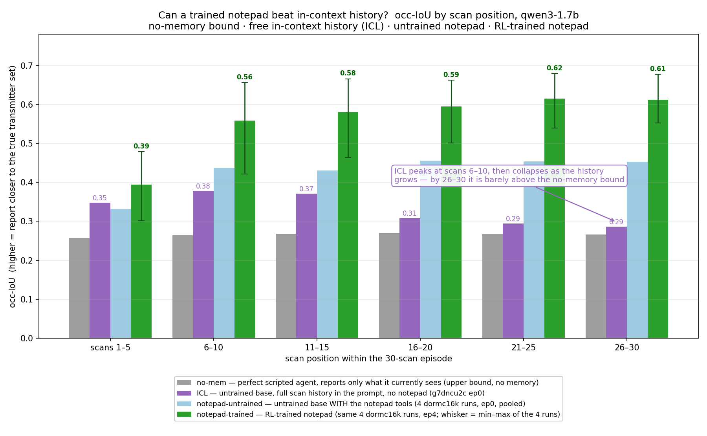
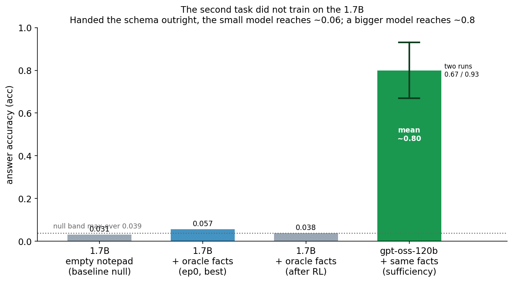

# Can you train a small LLM to use a notepad better than its own context window?

*A controlled study on Qwen3-1.7B. The Continual-Learning Bench reported that giving a model an external
**notepad** doesn't reach the accuracy of just keeping the whole history **in context** (ICL). That's
backwards from what you'd hope — a notepad is more flexible and keeps the prompt short. So we asked: can
reinforcement learning teach a small model to use a notepad well enough to **match or beat ICL** — without
making it any better at the underlying task? The answer is yes, and the reason ICL loses is worth seeing.*

---

## The puzzle

In the Continual-Learning Bench (CLBench), agents solve a long series of related steps and are given a
scratch **notepad** to carry information forward. The surprising finding: **the notepad doesn't reach the
accuracy of in-context learning** — where nothing is written down and the model simply re-reads its entire
past history from the prompt.

That is puzzling. A notepad should be the *better* tool. It's a compressed, curated summary you control; it
keeps the prompt short; it never buries the important fact under 20 turns of transcript. If writing things
down loses to hoarding raw history, maybe the problem isn't the notepad — maybe **the model was never
trained to use one.**

So the question of this write-up:

> Can RL train a small model (Qwen3-1.7B) to use an external notepad to **match or beat ICL** — while
> provably **not** improving the model at the single-step task itself? I.e. can we train the *memory
> behavior* in isolation, and does trained memory then beat free in-context history?

The whole answer is in one figure:

> Over a 30-scan episode, **ICL leads only at the very start.** It peaks around scans 6–10, then **collapses
> as the history grows** — by scans 26–30 it is barely above the no-memory bound. The **untrained** notepad
> already beats ICL from scan 6 on; **RL-trained**, it climbs to ~0.61 and holds. And it does this *without*
> getting better at the task: on scan 1, where the notepad is empty, trained and untrained score identically.

---

## The task: watching a band you can't fully see

The task is derived from CLBench's **blind spectrum monitoring.** An agent watches one radio-frequency band
containing ~11–14 transmitters. It receives a series of **30 sequential scans** of the *same* band. The
catch: in any scan only ~3 transmitters are actually emitting, and the detector is noisy (missed detections,
false alarms). Dormant transmitters still **occupy** the band; they just aren't visible this instant.

So to report **all** occupied regions, the agent has to *remember* transmitters it saw earlier and keep
reporting them while they're silent. The per-scan score is **occupied-IoU** (occ): the overlap between the
regions you report and the true set of persistent transmitters, 0 to 1.

A scripted agent with **no memory** — one that reports exactly what it currently sees, with perfect widths —
scores occ ≈ **0.26**. That is not a weak strawman; it is the *upper bound* for any memoryless agent, and it
is the grey bar in the figure. Everything above it is the value of memory.

### The two ways to remember

- **ICL (in-context learning):** nothing is wiped. Every past scan, report and result stays in the prompt,
  and the model re-reads its own history. No notepad. This is CLBench's strong baseline.
- **Notepad:** the context is windowed to the current scan. The model has `notepad_read` / `notepad_write`
  tools and a short (~4000-char) buffer it overwrites each turn. That buffer is the **only** thing that
  crosses from one scan to the next. Maintaining it is the *agent's own job* — it must choose to write.

*(Full prompts, an example scan turn, the exact scoring and every anti-cheat guard are in
[`task/task_description.md`](task/task_description.md).)*

---

## The four conditions in the figure

| condition | what it is | memory |
|---|---|---|
| **no-mem** | scripted perfect agent, reports only what it currently sees, run through the real engine | none (upper bound) |
| **ICL** | untrained base model, full scan history in the prompt, no notepad | in-context |
| **notepad-untrained** | the *same* untrained base model, but with the notepad tools + windowed context | notepad |
| **notepad-trained** | that model after RL on a memory-only reward | notepad |

Two comparisons live in this one chart. **ICL vs. notepad-untrained** is a pure *memory-mode* comparison —
same base model, same weights, only the way it remembers differs. **notepad-untrained vs. notepad-trained**
is the pure *training* effect. Keeping them separate is what lets us say what RL actually bought.

The exact numbers (occ-IoU, pooled by scan position):

| scans | no-mem | ICL | notepad-untrained | notepad-trained |
|---|---|---|---|---|
| 1–5 | 0.257 | **0.348** | 0.332 | 0.394 |
| 6–10 | 0.264 | 0.378 | 0.436 | **0.559** |
| 11–15 | 0.268 | 0.371 | 0.431 | **0.581** |
| 16–20 | 0.270 | 0.308 | 0.455 | **0.595** |
| 21–25 | 0.268 | 0.294 | 0.454 | **0.615** |
| 26–30 | 0.266 | 0.286 | 0.453 | **0.612** |

---

## Reading the result

**ICL collapses over a long episode.** In-context history wins the first bin (scans 1–5: 0.348 vs the
notepad's 0.332), peaks at scans 6–10 (0.378), and then *falls* — 0.371, 0.308, 0.294, 0.286 — even though
strictly *more* information is present each scan. This is long-context degradation on a small model: facts
buried 20+ scans deep in a growing transcript effectively stop being used. By the end of the episode ICL
(0.286) is barely above the no-memory bound (0.266). Pooled over the late half (scans 16–30), ICL averages
just **0.297**.

**The untrained notepad already beats ICL — from scan 6 on.** Same model, no training. A ~13-line summary
pinned at the bottom of the prompt doesn't rot the way a 30-scan transcript does, so notepad-untrained holds
~0.45 across the whole late half while ICL slides to ~0.29. This alone re-frames the CLBench puzzle: the
notepad isn't inherently worse; on a long enough episode it is inherently *more robust*, because it doesn't
drown the signal in raw history.

**Training lifts the notepad further — to a clear win.** RL takes late-half occ from ~0.454 (untrained) to
**0.607** (trained), roughly doubling the margin over the no-memory floor and beating ICL by +0.31 late. The
model learns to accumulate more completely and forget less.

So the answer to the question is **yes**: a trained notepad beats free in-context history everywhere past the
first few scans — and even an untrained one does, once the history gets long.

---

## "Without improving the task" — and how we know

The claim that RL trained **memory** and not **task skill** is the load-bearing one, so it is defended three
ways, from design to measurement:

**1. The reward is orthogonal to task skill by construction.** RL pays for exactly one thing: a per-scan
Tversky overlap (`SCAN_DORM`) between the report and the set of channels that are **invisible right now but
were seen earlier** — the *recallable* set. Reporting a currently-visible channel is neither rewarded nor
punished. You cannot earn a cent of this reward without the notepad, because it scores precisely the part of
the answer that isn't on screen.

**2. An anchor guard pins the memory-free scans to the floor.** Scans 1–2, where almost nothing is
accumulable yet, measure raw task skill. A penalty activates if the model's accuracy there rises above the
scripted memoryless floor — so "get better without memory" earns nothing and can even be taxed.

**3. Scan-1 is measured, and it's flat.** On the very first scan the notepad is empty, so *any* gain there
would have to be band knowledge baked into the weights — not memory. Across all four training runs the scan-1
occ moves by **+0.0004 to +0.0011** — dead flat (pooled 0.216 → 0.217). The model did not get better at the
task. Every gain in the figure is memory.

Together with the guards against blanket-reporting cheats (below), this is what earns the phrase "trained
memory, not skill."

---

## Attacking our own reward before the model could

A reward that pays for coverage invites cheating. We simulated the cheats offline and built a guard for each,
so an honest memory policy pays zero and every shortcut costs:

- **Blanket the whole band** ("everything is occupied" → trivially high coverage): a **carpet** guard
  penalizes reported area above 1.15× the true occupied area.
- **Blanket, but stay under the area alarm / paint one huge region:** a **width** guard penalizes any single
  region wider than 1.5× the widest true channel.
- **Behave honestly on scans 1–2 to fool the anchor, then blanket:** caught by the width and area guards,
  which run every scan.
- **Memorize the fixed channel layout into the weights** ("gridbake") and always report all slots: false
  positives are scored against never-seen space, which an honest memory policy never paints — so a
  weights-memorized grid pays a penalty an honest notepad doesn't, and it would also light up the scan-1
  detector.
- **Truncate the episode** once coverage is banked: a **completion** hinge pays only if you finish all 30
  scans.

All four guards read ≈0 on honest play at epoch 0 in every run, so on honest rollouts the reward is literally
`3 × mean recallable-coverage` — a memory-only currency. *(The exact, re-implementable formula is in
[`task/task_description.md`](task/task_description.md).)*

---

## Is it repeatable?

The green bars are **four independent RL runs pooled** (Fireworks RFT jobs `s8e07n53`, `yp8deoer`,
`kym4znjc`, `wqjyy66p` — identical config, differing only in seed), and the whisker on each is the min–max
across those four runs. Direction of the effect replicated **4 of 4**: complete-episode recallable-coverage
rose in every run (+0.041 / +0.101 / +0.181 / +0.182), and scan-1 stayed flat in every run. The *magnitude*
varies run to run — which is exactly what the whisker shows, and why we pool rather than cherry-pick one
seed.

---

## Honesty box

- **Survivorship in the late bins.** At the trained epoch, episode completion across the four runs is
  100% / 97% / 60% / 90% — one run (`kym4znjc`) truncates heavily. Late bins therefore average only the scans
  actually played, so they carry a survivorship bias: the pooled sample size falls from 3840 (scans 1–5) to
  3171 (scans 26–30). The effect is disclosed, not removed; it is far smaller than in an earlier 8k-token
  cohort where 3 of 4 runs truncated.
- **The ICL bar is the untrained base**, in full-history mode, with a 4096-token cap (job `g7dncu2c`, ep0).
  We also *trained* an ICL arm: it learned to *degrade a little less* over a long context, but late-minus-
  early occ stayed negative every epoch — it never learned to accumulate. Training doesn't fix the collapse.
- **This is our re-implementation, not CLBench's exact harness.** The point is the *mechanism* (ICL rots on
  long episodes; a trained notepad doesn't) and the *trainability*, not a leaderboard number against CLBench.
- **One model, one optimizer.** Qwen3-1.7B, GRPO via Fireworks RFT; learning rate / temperature / group size
  not swept. `memory_gain` (a late−early delta) is measured but never rewarded — rewarding a delta invites
  sandbagging.

---

## Where it does *not* generalize

One trained task is a thin result, so we built a second, deliberately different CLBench notepad task to the
same standard: **`database_exploration`.** The agent answers a series of questions about an *unknown* SQLite
database; between questions the conversation is wiped and the notepad is all that persists. The memory payoff
is an **informed one-shot**: discover a schema quirk once (which obfuscated table is which category; prices
in cents vs. dollars; timestamps epoch-ms vs. ISO), write it down, and answer later questions without
re-querying. It shipped with six anti-baking database variants, an evidence gate against answer-smuggling,
and red-teamed reward floors.

It does **not** train on the 1.7B.

Four replicate GRPO runs are a flat null (accuracy ~3%, informed-one-shot ≡ 0). A single-lever diagnostic —
pre-seed the notepad with the **correct** schema, removing discovery entirely — lifts accuracy only to
**0.057** at epoch 0, then it decays under RL. Handed the answer schema outright, the 1.7B still gets 94% of
answers wrong: it can't reliably execute aggregate-SQL-with-unit-conversion even when told exactly what to
do. That the facts *are* answerable is not in doubt — the same pre-seeded notepad given to gpt-oss-120b
scores **0.67–0.93**. The verdict: a **discovery gap and an execution gap beneath it.** This task needs a
bigger base model. Hiding it would misrepresent what "RL trains memory" is worth at 1.7B.

---

## What it adds up to

- **A trained notepad beats in-context history** on a long continual task — and even an *untrained* notepad
  does, once the history grows long enough for ICL to rot. The CLBench puzzle ("notepad < ICL") is
  regime-dependent, and reverses with the right memory design and a little RL.
- **The win is memory, not skill.** By construction (reward orthogonal to visible channels), by guard
  (anchor pin), and by measurement (scan-1 dead flat), RL improved *carrying information forward* — not the
  single-step task.
- **It's repeatable in direction** (4 of 4 runs), with honestly disclosed variance in magnitude and a
  survivorship caveat in the latest bins.
- **Breadth is capped by scale.** A second, harder memory task doesn't move on 1.7B even handed the answer
  schema — the ceiling there is the base model, not the reward.

---

*Data behind the central figure: [`data/occ_by_scan_bin.csv`](data/occ_by_scan_bin.csv). Second-task data:
[`data/dbx_second_task.csv`](data/dbx_second_task.csv). Task details and the exact reward:
[`task/task_description.md`](task/task_description.md). Runs are Fireworks RFT job IDs (`s8e07n53`,
`yp8deoer`, `kym4znjc`, `wqjyy66p`, `g7dncu2c`, `v7uu671a` …), cited so each number traces to its source job.*
